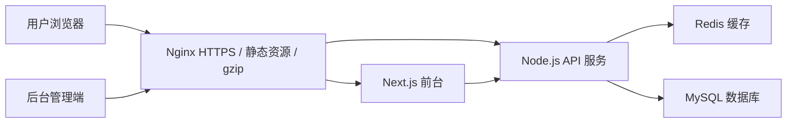

# 个人博客系统架构设计文档

## 1. 背景与目标

本系统用于承载个人博客与项目作品集，页面风格参考当前 UI 设计稿：克制、中文优先、项目展示有主次层级，支持后续持续追加项目与文章。

当前阶段先完成架构审核，审核通过后再进入代码实现。

## 2. 核心目标

- 页面响应速度快，首屏打开稳定、轻量。
- 支持博客首页、关于页、项目页、文章页、联系页、项目详情页、文章详情页。
- 项目展示支持一个主项目和多个普通项目，后续可持续追加。
- 前端使用 React，后端使用 Node.js。
- 数据库使用 MySQL + Redis，全部采用开源方案。
- 部署在单台 2 核 4G 服务器上，资源占用要克制。
- 正式实现中英文切换能力，中文为默认语言。

## 3. 推荐技术栈

### 3.1 前端

- React
- Next.js
- TypeScript
- Tailwind CSS
- shadcn/ui 或自建轻量组件

选择 Next.js 的原因：

- 支持静态生成和服务端渲染，博客和作品集非常适合做静态化。
- 首页、项目页、文章页可预渲染，减少 Node.js 接口压力。
- SEO 友好，文章页和项目页容易被搜索引擎收录。
- 支持图片优化、路由分层和后续 i18n 扩展。

### 3.2 后端

- Node.js
- Fastify
- TypeScript
- Prisma 或 Drizzle ORM
- Zod 做接口参数校验

推荐使用 Fastify：

- 性能轻，启动快，内存占用低。
- 适合 2 核 4G 单机部署。
- 博客系统业务不复杂，不需要过重框架。
- 仍然属于 Node.js 后端框架，不是 Python 框架。

如果后续后台管理复杂度显著上升，可以再评估 NestJS；第一版不建议使用 Java Spring Boot，主要原因是单机 2 核 4G 资源有限，而本系统业务复杂度不需要重框架。

### 3.3 数据与缓存

- MySQL 8.x
- Redis 7.x
- MySQL 存储业务数据。
- Redis 存储首页、文章列表、项目列表、热门数据和后台登录态。

### 3.4 部署与运维

- Ubuntu Server
- Docker
- Docker Compose
- Nginx 容器
- 前端 Next.js 容器
- 后端 Node.js API 容器
- MySQL 容器
- Redis 容器
- Certbot 免费 HTTPS 证书

2 核 4G 服务器建议不要上 Kubernetes，也不建议拆太多微服务。

所有运行组件第一版统一容器化，后续启停、重启、查看日志都通过 `docker compose` 处理，避免服务器上散落多个手动安装的服务。

## 4. 总体架构



### 4.1 前台访问链路

1. 用户访问首页、项目页、文章页。
2. Nginx 优先返回静态资源和缓存内容。
3. Next.js 返回静态生成页面或服务端渲染页面。
4. 动态数据通过 Node.js API 获取。
5. API 优先读 Redis，缓存未命中再读 MySQL。

### 4.2 后台管理链路

1. 管理员登录后台。
2. 后台调用 Node.js API。
3. API 写入 MySQL。
4. 写入成功后删除或刷新 Redis 缓存。
5. 前台下一次访问读取最新内容。

## 5. 前端页面架构

### 5.1 前台页面

| 页面 | 路由 | 渲染方式 | 说明 |
| --- | --- | --- | --- |
| 首页 | `/` | 静态生成 | 展示个人介绍、主项目、精选文章 |
| 关于页 | `/about` | 静态生成 | 展示个人介绍和工作方式 |
| 项目页 | `/projects` | 静态生成 | 主项目 + 项目矩阵 |
| 项目详情页 | `/projects/[slug]` | 静态生成 | 展示项目目标、职责、技术方案、成果 |
| 文章页 | `/posts` | 静态生成 | 文章列表、分类、标签 |
| 文章详情页 | `/posts/[slug]` | 静态生成 | Markdown/MDX 内容展示 |
| 联系页 | `/contact` | 静态生成 | 邮箱、合作方向、社交链接 |

### 5.2 后台页面

| 页面 | 路由 | 说明 |
| --- | --- | --- |
| 登录 | `/admin/login` | 管理员登录 |
| 仪表盘 | `/admin` | 基础统计和快捷入口 |
| 项目管理 | `/admin/projects` | 新增、编辑、排序、上下架项目 |
| 文章管理 | `/admin/posts` | 新增、编辑、发布、草稿 |
| 分类标签 | `/admin/taxonomies` | 管理分类和标签 |
| 站点配置 | `/admin/settings` | 首页文案、联系信息、SEO |

后台管理能力通过权限控制实现，页面仍在同一套系统中：

- 普通用户只能访问公开查询能力。
- 管理员登录后才显示新增、编辑、删除、发布、排序等操作按钮。
- 后台管理页面和接口都必须做权限校验，不能只依赖前端隐藏按钮。

第一版建议后台管理端放在同一个 Next.js 项目内，减少部署复杂度。

## 6. 项目展示设计

项目展示采用“一个主项目 + 多个普通项目”的结构。

### 6.1 主项目

主项目用于突出当前最能代表个人能力的项目，例如：

- 恩特学术
- 展示前台
- 后台管理端
- 同步上下游数据的中间件

主项目字段：

- 项目名称
- 项目简介
- 项目封面
- 角色职责
- 技术栈
- 关键模块
- 项目链接
- 是否主项目
- 排序值

### 6.2 普通项目

普通项目采用紧凑卡片或列表展示，方便后续持续追加。

普通项目字段：

- 项目名称
- 一句话介绍
- 标签
- 项目类型
- 详情页链接
- 排序值
- 是否展示

## 7. 后端模块设计

### 7.1 API 模块

- Auth 模块：后台登录、退出、权限校验。
- Post 模块：文章 CRUD、发布、草稿、搜索。
- Project 模块：项目 CRUD、排序、主项目设置。
- Tag 模块：标签和分类管理。
- Asset 模块：图片上传、封面管理。
- Setting 模块：站点配置、SEO、联系信息。

### 7.2 API 命名

```text
GET    /api/site
GET    /api/posts
GET    /api/posts/:slug
POST   /api/admin/posts
PUT    /api/admin/posts/:id
DELETE /api/admin/posts/:id

GET    /api/projects
GET    /api/projects/:slug
POST   /api/admin/projects
PUT    /api/admin/projects/:id
DELETE /api/admin/projects/:id

POST   /api/admin/login
POST   /api/admin/logout
GET    /api/admin/me
```

### 7.3 接口性能原则

- 前台接口只返回页面需要的字段。
- 列表接口不返回正文大字段。
- 文章详情按 slug 查询，slug 建唯一索引。
- 首页接口聚合数据后写入 Redis，避免每次查多张表。
- 后台接口不做复杂联表统计，统计可异步或缓存。

## 8. 数据库设计

### 8.1 users

管理员表。

| 字段 | 类型 | 说明 |
| --- | --- | --- |
| id | bigint | 主键 |
| username | varchar(64) | 用户名 |
| password_hash | varchar(255) | 密码哈希 |
| role | varchar(32) | 角色 |
| created_at | datetime | 创建时间 |
| updated_at | datetime | 更新时间 |

### 8.2 posts

文章表。

| 字段 | 类型 | 说明 |
| --- | --- | --- |
| id | bigint | 主键 |
| title | varchar(200) | 标题 |
| slug | varchar(220) | URL 唯一标识 |
| summary | varchar(500) | 摘要 |
| content | mediumtext | 正文 |
| cover_url | varchar(500) | 封面 |
| status | varchar(32) | draft/published |
| published_at | datetime | 发布时间 |
| created_at | datetime | 创建时间 |
| updated_at | datetime | 更新时间 |

索引：

- unique key `uk_posts_slug(slug)`
- key `idx_posts_status_published(status, published_at)`

### 8.3 projects

项目表。

| 字段 | 类型 | 说明 |
| --- | --- | --- |
| id | bigint | 主键 |
| title | varchar(200) | 项目名称 |
| slug | varchar(220) | URL 唯一标识 |
| summary | varchar(500) | 摘要 |
| description | text | 详情描述 |
| cover_url | varchar(500) | 封面 |
| project_url | varchar(500) | 项目地址 |
| repo_url | varchar(500) | 代码仓库 |
| role_desc | varchar(500) | 个人职责 |
| is_featured | tinyint | 是否主项目 |
| sort_order | int | 排序 |
| status | varchar(32) | draft/published |
| created_at | datetime | 创建时间 |
| updated_at | datetime | 更新时间 |

索引：

- unique key `uk_projects_slug(slug)`
- key `idx_projects_status_sort(status, sort_order)`
- key `idx_projects_featured(is_featured, status)`

### 8.4 tags

标签表。

| 字段 | 类型 | 说明 |
| --- | --- | --- |
| id | bigint | 主键 |
| name | varchar(64) | 标签名 |
| slug | varchar(80) | 标签标识 |
| type | varchar(32) | post/project |

### 8.5 post_tags / project_tags

文章、项目与标签的关联表。

### 8.6 settings

站点配置表。

| 字段 | 类型 | 说明 |
| --- | --- | --- |
| id | bigint | 主键 |
| config_key | varchar(100) | 配置键 |
| config_value | json | 配置值 |
| updated_at | datetime | 更新时间 |

## 9. Redis 缓存设计

### 9.1 缓存 Key

```text
site:home
site:settings
posts:list:page:{page}:tag:{tag}
posts:detail:{slug}
projects:list
projects:detail:{slug}
admin:session:{token}
```

### 9.2 缓存策略

- 首页缓存 5 分钟。
- 项目列表缓存 10 分钟。
- 文章列表缓存 5 分钟。
- 文章详情缓存 30 分钟。
- 项目详情缓存 30 分钟。
- 后台发布、修改、删除内容后主动删除相关缓存。

### 9.3 缓存原则

- 缓存页面聚合结果，不缓存过细碎字段。
- 后台写操作后删除缓存，不直接更新复杂缓存。
- 防止缓存击穿：读取详情时如果 MySQL 不存在，也缓存空结果 1 分钟。

## 10. 性能设计

### 10.1 前端性能

- 首页、项目页、文章列表页优先静态生成。
- 图片使用 WebP 或 AVIF。
- 首屏图片控制在 200KB 左右。
- 开启 Next.js 图片优化。
- 组件按页面拆分，后台管理端不进入前台首屏包。
- 字体使用本地化或系统字体，避免加载过多字体文件。
- 使用 CDN 或 Nginx 静态缓存资源。

### 10.2 后端性能

- Fastify 运行在 API 容器中，第一版单容器单进程即可；如果后续访问量上升，再通过 Docker Compose 扩展 API 副本或调整 Node.js 进程数。
- 接口响应尽量控制在 100ms 内。
- MySQL 连接池控制在 5-10。
- Redis 连接复用。
- 列表分页限制默认 10-20 条。
- 后台上传图片限制大小，避免服务端内存暴涨。

### 10.3 MySQL 性能

- 所有 slug 查询使用唯一索引。
- 列表按 status + published_at/sort_order 索引查询。
- 避免正文 content 出现在列表接口中。
- 后期文章量很大时，可增加全文搜索方案；第一版不引入 Elasticsearch。

### 10.4 Nginx 性能

- 开启 gzip 或 brotli。
- 静态资源缓存 30 天。
- HTML 缓存时间较短，避免内容更新不及时。
- 限制上传大小。
- 配置 HTTP/2。

## 11. 2 核 4G 部署方案

### 11.1 服务分配

| 服务 | 建议资源 |
| --- | --- |
| Nginx | 低 |
| Next.js | 512MB-1GB |
| Node.js API | 512MB-1GB |
| MySQL | 1GB-1.5GB |
| Redis | 128MB-256MB |
| 系统余量 | 512MB+ |

### 11.2 容器化部署原则

项目使用 Docker Compose 管理所有服务：

- `nginx`：统一入口、HTTPS、静态资源、反向代理。
- `web`：Next.js 前台和后台页面。
- `api`：Node.js Fastify API 服务。
- `mysql`：业务数据库。
- `redis`：缓存和登录态。

所有服务通过同一个 `docker-compose.yml` 启停：

```bash
docker compose up -d
docker compose down
docker compose restart api
docker compose logs -f api
```

MySQL 和 Redis 使用 Docker volume 持久化数据，不能因为容器重建丢数据。

### 11.3 目录部署

```text
/var/www/blog
  /frontend
  /api
  /uploads
  /deploy
```

推荐服务器目录：

```text
/var/www/blog
  docker-compose.yml
  .env
  nginx/
    default.conf
  uploads/
  mysql-data/
  redis-data/
```

本地开发目录建议：

```text
blog/
  apps/
    web/
    api/
  packages/
    database/
    shared/
  deploy/
    nginx/
    docker-compose.yml
  uploads/
  docs/
```

### 11.4 Nginx 路由

```text
https://domain.com/        -> Next.js
https://domain.com/api/    -> Node.js API
https://domain.com/uploads -> 本地上传目录
```

### 11.5 Docker Compose 服务草案

```yaml
services:
  nginx:
    image: nginx:1.26-alpine
    depends_on:
      - web
      - api
    ports:
      - "80:80"
      - "443:443"
    volumes:
      - ./deploy/nginx/default.conf:/etc/nginx/conf.d/default.conf:ro
      - ./uploads:/var/www/uploads

  web:
    build:
      context: .
      dockerfile: apps/web/Dockerfile
    environment:
      - NODE_ENV=production
    depends_on:
      - api

  api:
    build:
      context: .
      dockerfile: apps/api/Dockerfile
    env_file:
      - .env
    depends_on:
      - mysql
      - redis
    volumes:
      - ./uploads:/app/uploads

  mysql:
    image: mysql:8.4
    command: --default-authentication-plugin=mysql_native_password
    env_file:
      - .env
    volumes:
      - mysql-data:/var/lib/mysql

  redis:
    image: redis:7.2-alpine
    command: redis-server --appendonly yes
    volumes:
      - redis-data:/data

volumes:
  mysql-data:
  redis-data:
```

实际编码阶段会根据最终目录结构补齐 Dockerfile、健康检查、资源限制和生产环境配置。

## 12. 安全设计

- 后台登录使用 httpOnly Cookie。
- 密码使用 bcrypt 或 argon2 哈希。
- 后台接口加 CSRF 防护或 SameSite Cookie。
- API 参数使用 Zod 校验。
- 上传文件校验 MIME、大小和后缀。
- Nginx 限制后台登录频率。
- `.env` 不进入代码仓库。
- 数据库只监听内网或本机。
- Redis 不暴露公网。

## 13. 内容管理流程

### 13.1 发布文章

1. 后台创建文章草稿。
2. 编辑标题、摘要、正文、标签、SEO。
3. 预览文章。
4. 发布文章。
5. API 写入 MySQL。
6. 删除文章列表、首页和文章详情缓存。
7. 前台展示最新内容。

### 13.2 发布项目

1. 后台创建项目。
2. 设置是否主项目。
3. 编辑项目职责、模块、链接和标签。
4. 发布项目。
5. 删除项目列表、首页和项目详情缓存。

## 14. 国际化预留

中英切换第一版正式实现，建议使用字段级多语言。

表中需要支持：

- `title_i18n`
- `summary_i18n`
- `content_i18n`
- `description_i18n`

也可以先采用 JSON：

```json
{
  "zh-CN": "中文内容",
  "en-US": "English content"
}
```

前端路由预留：

```text
/zh
/en
/zh/posts/[slug]
/en/posts/[slug]
```

第一版正式启用多语言路由。中文为默认语言，英文作为可切换语言。

## 15. 推荐目录结构

```text
blog-system/
  apps/
    web/
      app/
      components/
      lib/
      styles/
    api/
      src/
        modules/
        plugins/
        routes/
        services/
  packages/
    database/
      prisma/
      migrations/
    shared/
      types/
      validators/
  deploy/
    nginx/
    docker-compose.yml
    pm2.config.js
  docs/
```

如果想降低第一版复杂度，也可以使用两个项目：

```text
blog-frontend/
blog-api/
```

但长期建议 monorepo，方便共享类型和校验规则。

## 16. 首版开发范围

### 16.1 必做

- 前台首页
- 关于页
- 项目列表页
- 项目详情页
- 文章列表页
- 文章详情页
- 联系页
- 后台登录
- 项目 CRUD
- 文章 CRUD
- MySQL 数据表
- Redis 缓存
- Docker Compose 一键部署
- Nginx 容器反向代理

### 16.2 可后置

- 评论系统
- 全文搜索
- 多管理员权限
- 数据统计看板
- 中英文正式切换
- 图片云存储
- 邮件订阅

## 17. 关键决策点

需要审核确认：

1. 前端是否确定使用 Next.js，而不是纯 React SPA。
2. 后端是否使用 Fastify，还是改成 NestJS。
3. 后台管理端是否放在同一个 Next.js 项目内。
4. 图片是否第一版先存服务器本地，后期再迁到对象存储。
5. 多语言第一版正式实现，中英切换可用。
6. 是否需要文章 Markdown/MDX 编辑器。
7. 是否需要项目详情页支持富文本。

## 18. 初步结论

推荐第一版采用：

- 前端：Next.js + React + TypeScript
- 后端：Fastify + TypeScript
- 数据库：MySQL
- 缓存：Redis
- 部署：Docker Compose + Nginx + Docker volumes

这个方案对 2 核 4G 服务器友好，页面能通过静态生成和 Redis 缓存保证较快响应，同时支持后台权限管理、项目持续追加和正式中英切换。
